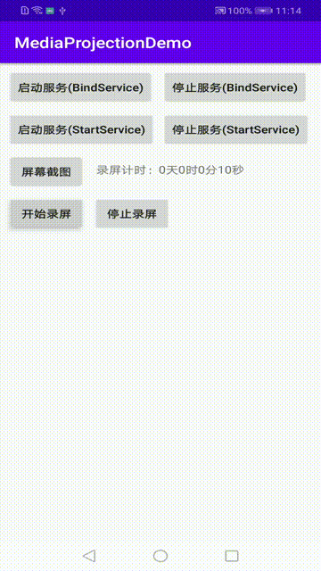

> ### Android MediaProjection Best Demo
> 集成了存储权限获取，存储在系统的截屏录屏目录下，两种启动方式的交互，非常Easy and Good，注意：bindService会和activity绑定，startService不会，详细可看代码！

> 本项目封装出来MediaProjectionHelper和MediaProjectionService，提供录屏回调计时，简化使用，参考项目：[https://github.com/SMask/MediaProjectionLibrary_Android](https://github.com/SMask/MediaProjectionLibrary_Android) 并优化完善之，Salute!!

> android在5.0系统之前，是没有开放视频录制的接口的，如果要录制视频，必须要先root。在5.0，Google终于开放了视频录制的接口（其实严格来说，是屏幕采集的接口），也就是MediaProjection和MediaProjectionManager!

> 效果图如下(gif不清晰可查看视频:
> 
